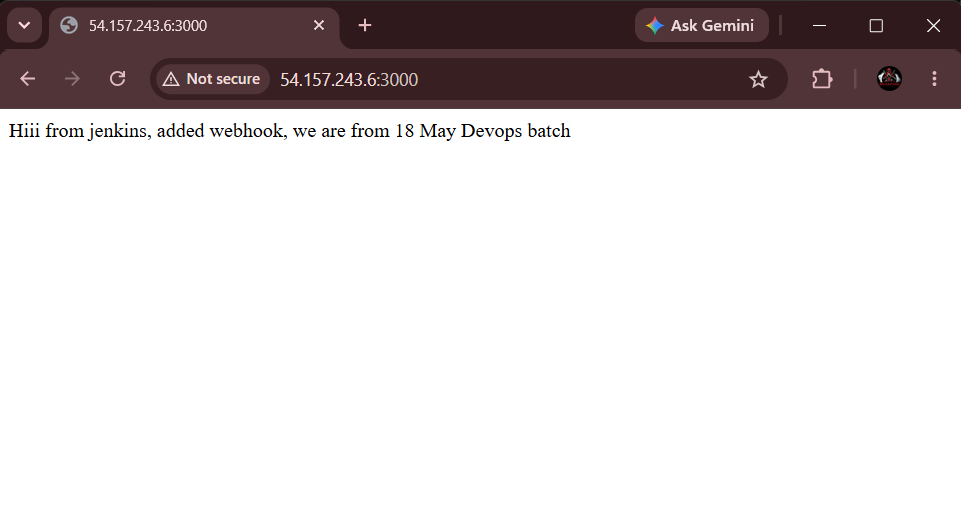

# 🟢 Nodejs-app

A simple **Node.js (Express.js)** web application, built to demonstrate deploying a lightweight web app on an **AWS EC2** instance using Amazon Linux.

## 📖 Overview

This project is a minimal Express.js application with a single route (`/`) that returns a plain-text response.

The project demonstrates the basic process of:

**AWS EC2 → Amazon Linux → SSH → Node.js → npm → GitHub → Express.js → PM2**

---

## 🛠️ Tech Stack

* 🟢 **Runtime:** Node.js
* 🚂 **Framework:** Express.js
* 📦 **Package Manager:** npm
* ☁️ **Cloud Provider:** AWS EC2
* 🐙 **Source Code:** GitHub
* ⚙️ **Process Manager:** PM2
* 🐧 **Operating System:** Amazon Linux

---

## 📂 Project Structure

```text
nodejs-app/
├── app.js           # Main Express.js application
├── package.json     # Project metadata and dependencies
└── README.md        # Project documentation
```

---

# ☁️ Deployment on AWS EC2

## 1️⃣ Launch an EC2 Instance

1. Log in to the AWS Management Console.
2. Go to **EC2 → Launch Instance**.
3. Select **Amazon Linux** as the AMI.
4. Select an appropriate instance type.
5. Create or select an existing key pair.
6. Configure the Security Group.

Allow the following inbound traffic:

| Type       | Port | Source      |
| ---------- | ---: | ----------- |
| SSH        |   22 | Your IP     |
| Custom TCP | 3000 | `0.0.0.0/0` |

> **Note:** Port `3000` is required because the Node.js application runs on port 3000.

7. Launch the EC2 instance.
8. Wait until the instance reaches the **Running** state.

---

## 2️⃣ SSH into Amazon Linux EC2

From your local terminal, connect to the EC2 instance:

```bash
ssh -i "your-key.pem" ec2-user@<EC2-PUBLIC-IP>
```

After successful login, you should see the Amazon Linux terminal.

---

## 3️⃣ Update Amazon Linux

Update the installed packages:

```bash
sudo yum update -y
```

---

## 4️⃣ Install Node.js

Install Node.js:

```bash
sudo yum install nodejs -y
```
Check node Version
```bash
node --version
```
or:

```bash
node -v
```

## 5️⃣ Install npm

Install npm:

```bash
sudo yum install npm -y
```

Verify npm installation:

```bash
npm --version
```

or:

```bash
npm -v
```
---

## 6️⃣ Install Git

Install Git on the EC2 instance:

```bash
sudo yum install git -y
```

Verify Git:

```bash
git --version
```

Example:

```text
git version 2.x.x
```

---

## 7️⃣ Clone the GitHub Repository

Clone the project from GitHub:

```bash
git clone https://github.com/vinit-22/nodejs-app.git
```

Move into the project directory:

```bash
cd nodejs-app
```
---

## 8️⃣ Install Project Dependencies

Install the dependencies defined in `package.json`:

```bash
npm install
```

This will create the `node_modules` directory and install Express.js and other required packages.

---

## 9️⃣ Run the Node.js Application

Start the application directly using Node.js:

```bash
node app.js
```

If the application is configured to listen on port `3000`, it will be available at:

```text
http://<EC2-PUBLIC-IP>:3000
```

### Stop the application

To stop the running application:

```text
Ctrl + C
```

---

## 🔟 Run Node.js Application in Background Using PM2

Running:

```bash
node app.js
```

keeps the application attached to the current terminal session.

If you close the SSH connection, the application can stop.

To keep the application running in the background, use **PM2**.

## Install PM2

Install PM2 globally:

```bash
sudo npm install -g pm2
```

Verify PM2:

```bash
pm2 --version
```

## ▶️ Start Application Using PM2

Start the application:

```bash
sudo pm2 start app.js
```

Check the running processes:

```bash
sudo pm2 list
```

## ⏹️ Stop Application

To stop the application:

```bash
sudo pm2 stop app.js
```

## 🔄 Restart Application

To restart the application:

```bash
sudo pm2 restart app.js
```

## 📋 Check Application Status

```bash
sudo pm2 status
```

## 📜 View Application Logs

```bash
sudo pm2 logs
```

To exit the logs:

```text
Ctrl + C
```

---

# 📤 Output

When you access:

```text
http://<EC2-PUBLIC-IP>:3000/
```

the application should display:



# 🚧 Future Enhancements

* 🔧 **Jenkins CI/CD** — automatically build and deploy the application whenever changes are pushed to GitHub.
* 🐳 **Docker** — containerize the Node.js application.
* 🔄 **Jenkins Webhook** — trigger deployment automatically after a GitHub push.
* 🌐 **Nginx** — use Nginx as a reverse proxy for the Node.js application.
* 🔐 **HTTPS** — configure SSL/TLS using a domain and certificate.
* 📈 **AWS Load Balancer** — distribute traffic across multiple EC2 instances.
* 🔄 **Auto Scaling** — automatically scale EC2 instances according to demand.
* 🔑 **AWS Secrets Manager / Parameter Store** — securely manage application configuration and secrets.

---

# 📄 License

This project is provided as-is for learning and demonstration purposes.

---

# ✍️ Author

**Vinit Mistry**
